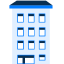

# Python

## Basic Data Types

### Primitives

1. Strings `str`
2. Numerical types:
    * Integers `int`
    * Float `float`
<!--You can find out the type of a variable by using the type() method.-->

## Variables

Python variables are dynamically typed.

```python
    x = 1         # integer
    y = 1.0       # float
    z = "string"  # string
```

## Operators

Python permits all basic operator types

```python
    print(10 + 10)   # addition
    print(100 - 10)  # subtraction
    print(10 * 10)   # multiplication
    print(77 / 10)   # division
    print(77 // 10)  # integer division
    print(7 % 2)     # modulo
    print(10 ** 2)   # exponentiation
```
<!--Division by zero is not permited in Python-->

## Type casting

Python is dynamically typed with strong typing meaning that varaibles do not have a type and can be changed to differnt types at runtime. But at the same time it also uses strong typing which means that **type coersion** can't be done, this  `"125" + 10` for exemple leads to a `TypeError`.

The below are permitted though:

```python
    print(125 + 125)                 # "250"
    print("125" + "125")             # "125125"
    print(125 * 4)                   # "500"
    print("125" * 4)                 # "125125125125"
    print("This is a number:", 125)  # "This is a number: 125"
```

### Explicit type casting

The process of converting a value to another type is also called type casting. Though implicit type casting isn't allowed in Python you will often find yourself in need to define an explicit type conversion within your code.

```python
    f = 3.14        # the type is float
    print(type(f))  # <class 'float'>
    s = str(f)      # converting float to string
    print(type(s))  # <class 'str'>
    i = int(f)      # while converting a float value    to   an integer its fractional part is discarded
    print(i)        # 3
    print(type(i))  # <class 'int'>
    f = float(i)    # converting integer to float
    print(f)        # 3.0
    print(type(f))  # <class 'float'>
```

## Function

### Built-in functions

```python
    # finding the length of an object
    print(len(number))  # 3

    # converting types
    integer = int(number)
    float_number = float(number)
    print(str(float_number))  # "111.0"

    # adding and rounding numbers
    my_sum = sum((integer, float_number))
    print(my_sum)  # 222.0
    print(round(my_sum))  # 222

    # finding the minimum and the maximum
    print(min(integer, float_number))  # 111
    print(type(max(integer, float_number, my_sum)))  # <class   'float'>

    print(input())  # permits the user to input data
```

## Numbers

### Reading numbers from user input

 `input()` returns a string, to use a number it has to be converted:

 ```python
    a_int = int(input())
    a_float = float(input())
```

## Strings

### String methods

#### 1. "Changing" a string

The first group of string methods consists of the ones that "change" the string in a specific way, that is they return the copy with some changes made.

Here’s a list of common string methods of that kind:

* `str.replace(old, new[, count])` replaces all occurrences of old with the new. The count argument is optional, and if it is specified, only the first count occurrences are replaced.

* `str.upper()` converts all characters of the string to the upper case.

* `str.lower()` converts all characters of the string to the lower case.

* `str.title()` converts the first character of each word to upper case.

* `str.swapcase()` converts upper case to lower case and vice versa.

* `str.capitalize()` changes the first character of the string to the upper case and the rest to the lower case.

#### 2. "Editing" a string

Often, when you read a string from somewhere (a file or the input) you need to edit it so that it contains only the information you need. For instance, the input string can have a lot of unnecessary whitespaces or some trailing combinations of characters. The "editing" methods that can help with that are `strip()`, `rstrip()` and `lstrip()`.

* `str.lstrip([chars])` removes the leading characters (i.e. characters from the left side). If the argument `chars` isn’t specified, leading whitespaces are removed.

* `str.rstrip([chars])` removes the trailing characters (i.e. characters from the right side). The default for the argument `chars` is also whitespace.

* `str.strip([chars])` removes both the leading and the trailing characters. The default is whitespace.

```python
    whitespace_string = "     hey      "
    normal_string = "incomprehensibilities"

    # delete spaces from the left side
    whitespace_string.lstrip()  # "hey      "

    # delete "i" or "s" or "is" from the left side
    normal_string.lstrip("is")  #   "ncomprehensibilities"

    # delete spaces from the right side
    whitespace_string.rstrip()  # "     hey"

    # delete "i" or "s" or "is" from the right side
    normal_string.rstrip("is")  #   "incomprehensibilitie"

    # no spaces from both sides
    whitespace_string.strip()  # "hey"

    # delete trailing "i" or "s" or "is" from both  sides
    normal_string.strip("is")  # "ncomprehensibilitie"
```

Keep in mind that the methods `strip()`, `lstrip()` and `rstrip()` get rid of all possible combinations of specified characters:

```python
    word = "Mississippi"
    print(word.lstrip("ips"))  # "Mississippi"
    print(word.rstrip("ips"))  # "M"
    print(word.strip("Mips"))  # ""
```

#### 3. Boolean search in a string

Other two useful methods are `startswith()` and `endswith()` that search for the particular pattern in the immediate beginning or end of a string and return True if the pattern is found. Here's the basic syntax of those methods with some simple examples:

```python
    email = "email_address@something.com"
    email.startswith("www.")  # False
    email.endswith("@something.com")  # True
```

Optional arguments `start` and `end` can be added, and in this case, the area of search is delimited by `start` and `end` parameters.

```python
    # syntax: str.startswith(pattern, start, end)

    email = "My email address is 'my_email@something.   com'"
    email.startswith("email", 20)  # False
    email.endswith("@", 20, 30)  # True
```

## Membership testing

Most programs in Python use **containers**, these are data types that allow you to work with any number of objects. You can think of them as real containers filled with numerous things. The way objects are arranged in a container depends on the container type. Examples of built-in Python containers include lists, tuples, sets, dictionaries, strings, and bytes. You will meet these containers later!

When working with containers, you often have to check if a value is present in your container. In Python, operators `in` and `not in` are used for this purpose. The syntax is the same for all containers: `value in container` returns `True` if value exists in container and `False` otherwise. The `not in` operator does the opposite thing, it returns `True` if value does not exist in container.

### Testing for membership

Since it's intuitively more difficult to compare a string to a container, we could say that the membership operator works with strings in a particular way.

The syntax is `pattern in text`. Here, the left operand should be a string, and membership test checks if text contains pattern as a substring, that is, a part of this string. If membership test returns `True`, this means that there exists a position in `text` starting from which you can read `pattern` in `text`.  An empty string is considered to be a substring of any string.

```python
print('apple' in 'pineapple')  # True
print('milk' in 'yogurt')      # False
print('' in '')                # True
print('' not in 'lemon')       # False
```

## Comparison operators

Comparison or relation operations let you compare two values and determine the relation between them. There are ten comparison operators in Python:

* `<` strictly less than
* `<=` less than or equal
* `>` strictly greater than
* `>=` greater than or equal
* `==` equal
* `!=` not equal
* `is` object identity
* `is not` negated object identity
* `in` membership
* `not in` negated membership.

The result of applying these operators is always `bool`. The following sections focus on the first six operators, but you can find more details about identity and membership testing in the next topics.

## if-else

### Simple if-else

An if-else statement is another type of conditional expressions in Python. It differs from an `if` statement by the presence of the additional keyword `else`. The block of code that `else` contains executes when the condition of your `if` statement does not hold (the Boolean value is False). Since an `else` statement is an alternative for an `if` statement, only one block of code can be executed. Also,  `else` doesn't require any condition:

```python
if today == "holiday":
    print("Lucky you!")
else:
    print("Keep your chin up, then.")
```

Note that the 4-space indentation rule applies here too.

As you may soon find out, programmers do like all sorts of shortcuts. For conditional expressions there's a trick as well – you can write an if-else statement in one line just like that:

`print("It’s a day now!" if sun else "It’s a night for sure!")`

Or, more generally:

`first_alternative if condition else second_alternative`

It's a matter of convenience, but remember that the code you create should still be readable.

### Nested if-else

It should be mentioned, that if-else statements can be nested the same way as if statements. An additional conditional expression may appear after the if section as well as after the else section. Once again, don't forget to indent properly:

```python
if x < 100:
    print('x < 100')
else:
    if x == 100:
        print('x = 100')
    else:
        print('x > 100')
    print('This will be printed only because x >= 100')
```

## Scope

### LEGB rule

A variable resolution in Python follows the LEGB rule. That means that the interpreter looks for a name in the following order:

* **Locals**. Variables defined within the function body and not declared global.
* **Enclosing**. Names of the local scope in all enclosing functions from inner to outer.
* **Globals**. Names defined at the top-level of a module or declared global with a global keyword.
* **Built-in**. Any built-in name in Python.

Let's consider an example to illustrate the LEGB rule:

```python
x = "global"
def outer():
    x = "outer local"
    def inner():
        x = "inner local"
        def func():
            x = "func local"
            print(x)
        func()
    inner()

outer()
```

When the `print()` function inside the `func()` is called the interpreter needs to resolve the name `x`. The search order will be as following: `func()` locals, `inner()` locals, `outer()` locals, globals, built-in names. So if we execute the code above it will print `func local`.

### Keywords "nonlocal" and "global"

We already mentioned one way to assign a global variable: make a definition at the top-level of a module. But there is also a special keyword `global` that allows us to declare a variable global inside a function's body.

You can't change the value of a global variable inside the function without using the `global` keyword:

```python
x = 1
def print_global():
    print(x)

print_global()  # 1

def modify_global():
    print(x)
    x = x + 1

modify_global()  # UnboundLocalError
```

An error is raised because we are trying to assign to a local variable `x` the expression that contains `x` and the interpreter can't find this variable in a local scope. To fix this error, we need to declare x global:

```python
x = 1
def global_func():
    global x
    print(x)
    x = x + 1

global_func()  # 1
global_func()  # 2
global_func()  # 3
```

When `x` is `global` you can increment its value inside the function.

`nonlocal` keyword lets us assign to variables in the outer (but not `global`) scope:

```python
def func():
    x = 1
    def inner():
        x = 2
        print("inner:", x)
    inner()
    print("outer:", x)

def nonlocal_func():
    x = 1
    def inner():
        nonlocal x
        x = 2
        print("inner:", x)
    inner()
    print("outer:", x)

func()  # inner: 2
        # outer: 1

nonlocal_func()  # inner: 2
                 # outer: 2
```

Though `global` and `nonlocal` are present in the language, they are not often used in practice. This is because these keywords make programs less predictable and harder to understand.

## List

In your programs, you often need to group several elements in order to process them as a single object. For this, you will need to use different collections. One of the most useful collections in **Python** is a list. It is one of the most important things in Python.

### Creating and printing lists

Look at a simple list that stores several names of dogs' breeds:

```python
dog_breeds = ['corgi', 'labrador', 'poodle', 'jack russel']
print(dog_breeds)  # ['corgi', 'labrador', 'poodle', 'jack russel']
```

In the first line, we use square brackets to create a list that contains four elements and then assign it to the `dog_breeds` variable. In the second line, the list is printed through the variable's name. All the elements are printed in the same order as they were stored in the list because lists are **ordered**.

Here is another list that contains five integers:

```python
numbers = [1, 2, 3, 4, 5]
print(numbers)  # [1, 2, 3, 4, 5]
```

Another way to create a list is to invoke the `list` function. You do so when you want to create a list out of an **iterable** object: that is, a kind of object where you can get its elements one by one. A list itself is iterable, so are other collections in Python, as well as a string.

The following example demonstrates the difference between using `list` and `[]` when creating a list:

```python
multi_elements_list = list('danger!')
print(multi_elements_list)  # ['d', 'a', 'n', 'g', 'e', 'r', '!']

single_element_list = ['danger!']
print(single_element_list)  # ['danger!']
```

So, the `list` function creates a list containing each element from the given iterable object such as a string. You can use square brackets or invoke the `list` functions depending on your task.

The square brackets and the `list` function can also be used to create **empty lists** that do not have elements at all.

```python
empty_list_1 = list()
empty_list_2 = []
```

### Features of lists

Lists can store **duplicate values** as many times as needed.

```python
on_off_list = ['on', 'off', 'on', 'off', 'on']
print(on_off_list)  # ['on', 'off', 'on', 'off', 'on']
```

Another important thing about lists is that they can contain **different types** of elements. So there are neither restrictions, nor fixed list types, and you can add to your list any data you want, like in the following example:

```python
different_objects = ['a', 1, 'b', 2
```

### Length of a list

Sometimes you need to know how many elements are there in a list. There is a built-in function called `len` that can be applied to any **iterable** object, and it returns simply the **length** of that object

So, when applied to a list, it returns the number of elements in that list.

```python
numbers = [1, 2, 3, 4, 5]
print(len(numbers))  # 5

empty_list = list()
print(len(empty_list))  # 0

single_element_list = ['danger!']
print(len(single_element_list))  # 1

multi_elements_list = list('danger!')
print(len(multi_elements_list))  # 7
```

In the example above, you can see how the `len()` function works. Again, pay attention to the difference between `list()` and `[]` as applied to strings: it may not result in what you expected.

## For loop

### What is iteration?

Computers are known for their ability to do things which people consider to be boring and energy-consuming. For example, repeating identical tasks without any errors is one of these things. In Python, the process of repetitive execution of the same block of code is called an **iteration**.

There are two types of iteration:

**Definite iteration**, where the number of repetitions is stated in advance.

**Indefinite iteration**, where the code block executes as long as the condition stated in advance is true.

After the first iteration, the program comes back to the beginning of the code’s body and repeats it, making the so-called loop. The most used one is the `for` **loop**, named after the `for` `operator` that provides the code’s execution.

### For loop syntax

Here is the scheme of the loop:

```pyhon
for variable in iterable:
    statement
```

where **statement** is a block of operations executed for each item in iterable, an object used in iteration (e.g. string or list). Variable takes the value of the next iterable after each iteration.

Now try to guess which output we’ll get if we execute the following piece of code:

```python
oceans = ['Atlantic', 'Pacific', 'Indian', 'Southern', 'Arctic']
for ocean in oceans:
    print(ocean)
```

During each iteration the program will take the items from the list and execute the statements with them, so the output will be:

```python
Atlantic
Pacific
Indian
Southern
Arctic
```

Even strings are iterable, so you can spell the word, for example:

```python
for char in 'magic':
    print(char)
```

Like this:

```python
m
a
g
i
c
```

### Input data processing

You can also use the `input()` **function** that helps a user to pass a value to some variable and work with it. Thus, you can get the same output as with the previous piece of code:

```python
word = input()
for char in word:
    print(char)
```

Oh, look, you can write a piece of code with a practical purpose:

```python
times = int(input('How many times should I say "Hello"?'))
for i in range(times):
    print('Hello!')
```

You can, therefore, ask a user to specify the number of iterations to be performed.

### Range function

The `range()` function is used to specify the number of iterations. It returns a sequence of numbers from 0 (by default) and ends at a specified number. Be careful: the last number won’t be in the output.

Let's look at the example below:

```python
for i in range(5):
    print(i)
```

What we'll get is this:

```python
0
1
2
3
4
```

You can change the **starting value** if you’re not satisfied with 0, moreover, you can configure the **increment (step)** value by adding a third parameter:

```python
for i in range(5,30,5):
    print(i)
```

According to the parameters included, we’ve asked to print the numbers from 5 to 30 with an increment value of 5. Be careful again, the last value is not included in the output:

```python
5
10
15
20
25
```

### Nested loop

In Python, it is easy to put one loop inside another one – a **nested loop**. The type of inner and outer loops doesn’t matter, the first to execute is the outer loop, then the inner one executes:

```python
names = ['Rose', 'Daniel']
surnames = ['Miller']
for name in names:
    for surname in surnames:
         print(name, surname)
```

The output is shown below:

```python
Rose Miller
Daniel Miller
```

In this example,  we use the two `for` loops to create fictional people's names. Obviously, you can deal with iterable objects of different sizes without too much fuss.

## Loop control statements

### Modifying loops

Loop control statements are nested inside loops and designed to change their typical behavior. In this topic, we'll find out how they work and what they are used for.

### How to break

The **break** statement is used to terminate a loop of any type (i. e. `for` and `while` loops). It may be said that break "jumps out" of the loop where it was placed. Let’s examine a tiny example:

```python
pets = ['dog', 'cat', 'parrot']
for pet in pets:
    print(pet)
    if pet == 'cat':
        break
```

We wanted to stop the loop before it iterated for the last time. For that purpose, we introduced a condition when the loop should be stopped. The output is as follows:

```python
dog
cat
```

Be careful where you put `print()`. If you put it at the loop’s end, the output will return only the first value – ‘dog’. This happens because **break** exits from the loop immediately.

Often enough, **break** is used to stop endless while loops like this one:

```python
count = 0
while True:
    print("I am Infinite Loop")
    count += 1
    if count == 13:
        break
```

### How to continue

The **continue** operator is commonly used, too. You can stop the iteration if your condition is true and return to the beginning of the loop (that is, jump to the loop's top and continue execution with the next value). Look at the following example:

```python
pets = ['dog', 'cat', 'parrot']
for pet in pets:
    if pet == 'dog':
        continue
    print(pet)
```

The output will contain all values except the first one ('dog') since it fulfills the condition:

```python
cat
parrot
```

Thus, the loop just skips one value and goes on running.

One nuance is worth mentioning: the **continue** operator should be used moderately. Sometimes you can shorten the code by simply using an `if` statement with the **reversed** condition:

```python
pets = ['dog', 'cat', 'parrot']
for pet in pets:
    if pet != 'dog':
        print(pet)
```

In this case, the output will remain the same:

```python
cat
parrot
```

### Loop else clause

If the loop didn’t encounter the break statement, an **else clause** can be used to specify a block of code to be executed after the loop.

```python
pets = ['dog', 'cat', 'parrot']
for pet in pets:
    print(pet)
else:
    print('We need a turtle!')
```

So after the loop body, the else statement will execute:

```python
dog
cat
parrot
We need a turtle!
```

Importantly, loop `else` runs if and only if the loop is exited normally (without hitting **break**). Also, it is run when the loop is never executed (e. g. the condition of the `while` loop is false right from the start). Consider an example:

```python
pancakes = 2
while pancakes > 0:
    print("I'm the happiest human being in the world!")
    pancakes -= 1
    if pancakes == 0:
        print("Now I have no pancakes!")
        break
else:
    print("No pancakes...")
```

When we run the code for the first time we'll get this output:

```html
I'm the happiest human being in the world!
I'm the happiest human being in the world!
Now I have no pancakes!
```

Execution of the code snippet for the second time (when the condition is not met, for pancakes = 0) will end up with another message:

```python
No pancakes...
```

## OOP

### Fundamentals

Object-oriented programming (OOP) is a programming paradigm based on the concept of objects that interact with each other to perform the program functions. Each object can be characterized by a state and behavior. An object keeps the current state in the fields and the behavior in the methods.

### Basic principles of OOP

There are four basic principles of OOP. They are **encapsulation**, **abstraction**, **inheritance**, and **polymorphism**.

* **Data encapsulation** is the mechanism of hiding the internal data of objects from the world. All interaction with the object and its data are performed through its public methods. Encapsulation allows programmers to protect the object from inconsistency.

* **Data abstraction** means that objects should provide the simplified, abstract version of their implementations. The details of their internal work usually aren't necessary for the user, so there's no need to represent them. Abstraction also means that only the most relevant features of the object will be presented.

* **Inheritance** is a mechanism for defining parent-child relationships between classes. Often objects are very similar, so inheritance allows programmers to reuse common logic and at the same time introduce unique concepts into the classes.

* **Polymorphism** literally means one name and many forms, and it concerns the inheritance of the classes. Just as the name suggests, it allows programmers to define different logic of the same method. So, the name (or interface) stays the same, but the actions performed may be different. In practice, it is done with overloading or overriding.

These are the key concepts of OOP. Each object-oriented language implements these principles in its own way, but the essence stays the same from language to language.

### Objects

The key notion of the OOP is, naturally, an **object**. There are a lot of real-world objects around you: pets, buildings, cars, computers, planes, you name it. Even a computer program may be considered as an object.

It's possible to identify some important characteristics for real-world objects. For instance, for a building, we can consider a number of floors, the year of construction and the total area. Another example is a plane that can accommodate a certain number of passengers and transfer you from one city to another. These characteristics constitute the object's attributes and methods. Attributes characterize objects' data or states, and methods — its behavior.

In OOP, everything can be considered an object. Programs are made from different objects interacting with each other. An object's state and behavior are usually placed together, but it's not always so. Sometimes, we will see objects without a state or methods. This, of course, depends on the purpose of the program and the nature of an object.

### Classes

Often, many individual objects have similar characteristics. We can say these objects belong to the same type or class.

A class is another important notion of OOP. A class describes a common structure of similar objects: their fields and methods. It may be considered a template or a blueprint for similar objects. An object is an individual instance of a class.

Let's look at some examples below.

#### Example 1. The building class



An abstract building for describing buildings as a type of object (class)

Each building has the same attributes:

* the number of floors (an integer number);
* area (a floating-point number, square meters);
* year of construction (an integer number).

Each object of the building type has the same attributes but different values.

For instance:

* Building 1: the number of floors = 4, area = 2400.16, year of construction = 1966;
* Building 2: the number of floors = 6, area = 3200.54, year of construction = 2001.

It's quite difficult to determine the behavior of a building. But this example demonstrates attributes pretty well.

#### Example 2. The plane class


Unlike the building, it is easy to define the behavior of a plane. It can fly and transfer you between two points on the planet.

An abstract plane for describing all planes as a type of object (class)

Each plane has the following attributes:

* a name (a string, for example, "Airbus A320" or "Boeing 777");
* passengers capacity (an integer number);
* standard speed (an integer number);
* current coordinates (they are needed to navigate).

Also, it has a behavior (a method): transferring passengers from one geographical point to another. This behavior changes the state of a plane, namely, its current coordinates.
